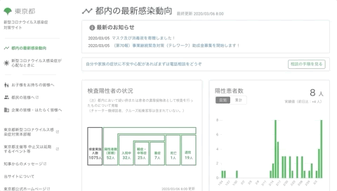

# 北海道 新型コロナウイルスまとめサイト


Illustration by [LITTLEKIT](https://twitter.com/LITTLEKIT)

## Goal
東京都庁による[新型コロナウイルス感染症対策サイト](https://stopcovid19.metro.tokyo.lg.jp/)の北海道版をつくるべや




[北海道版稼働イメージ(適宜更新)](https://docs.google.com/presentation/d/1IX5BiHa_Ukv7rulCf0RxOZpNoZmWXIvyRYFgXxg3zS8/edit?usp=sharing)

## How to Contribute / 貢献の仕方
[Issues](https://github.com/codeforsapporo/covid19/issues) にあるいろいろな修正にご協力いただけると嬉しいです。

Code for Sapporo のSlackでも情報共有を行っています。加入は[こちらからどうぞ](https://www.codeforsapporo.org/slack/)

本プロジェクトに関係するチャンネルは下記になります。
```
全般の相談
#0201covid19hkd_all
システム関係
#0202covid19hkd_sys
データ関係
#0203covid19hkd_data
Githubのissueメンション
#0204covid19hkd_notify
```

その他の詳しい情報は[How to contribute(東京版)](https://github.com/tokyo-metropolitan-gov/covid19/blob/development/.github/CONTRIBUTING.md)を御覧ください。

All contributions are welcome!
Please check [How to contribute](https://github.com/tokyo-metropolitan-gov/covid19/wiki/How-to-contribute) for details.

## License / ライセンス
本ソフトウェアは、MITライセンスの元提供されています。 
This software is released under the MIT License.

## For Developers / 開発者向け情報

### How to Set Up Environments / 環境構築の手順

**Use yarn / yarn を使う場合**
``` bash
# install dependencies
$ yarn install

# serve with hot reload at localhost:3000
$ yarn dev
```

**Use docker / docker compose を使う場合**
```bash 
# serve with hot reload at localhost:3000
$ docker-compose up
```

### Deployment to Staging & Production Environments / ステージング・本番環境への反映

`master` ブランチがアップデートされると、自動的に `production` ブランチにHTML類がbuildされます。そして、本番サイト https://stopcovid19.metro.tokyo.lg.jp/ が更新されます。

`staging` ブランチがアップデートされると、自動的に `gh-pages` ブランチにHTML類がbuildされます。そして、ステージングサイト https://stg-covid19-tokyo.netlify.com/ が更新されます。

`development` ブランチがアップデートされると、自動的に `dev-pages` ブランチにHTML類がbuildされます。そして、開発用サイト https://dev-covid19-tokyo.netlify.com/ が更新されます。


When `master` branch is updated, the HTML files will be automatically built onto `production` branch,
and then the production site (https://stopcovid19.metro.tokyo.lg.jp/) will be also updated.

When `staging` branch is updated, the HTML files will be automatically built onto `gh-pages` branch,
and then the staging site (https://stg-covid19-tokyo.netlify.com/) will be also updated.

When `development` branch is updated, the HTML files will be automatically built onto `dev-pages` branch,
and then the development site (https://dev-covid19-tokyo.netlify.com/) will be also updated.
